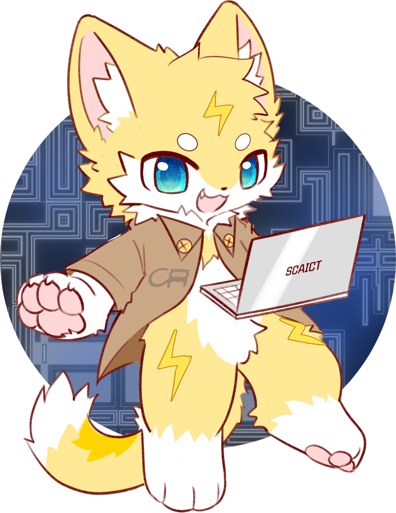

<!-- markdownlint-disable first-line-h1 -->
<!-- markdownlint-disable html -->

<div align="center">


# 中電喵 SCAICT uwu

[](https://github.com/SCAICT/SCAICT-uwu/actions/workflows/notion.yml)
[](https://scaict.org/)
[](https://store.scaict.org/)
[](https://g.scaict.org/doc/)
[](https://dc.scaict.org)
[](https://www.instagram.com/scaict.tw/)

</div>

# SCAICT-uwu

SCAICT-uwu is a playful and interactive Discord bot that resides in the SCAICT Discord community. Designed to bring fun and utility to its users, SCAICT-uwu loves to sing, dance, code, and do math, making it an engaging companion for the community members.

## Overview

SCAICT-uwu offers a range of interactive features, from daily activities to coding challenges. Whether you want to play games, solve puzzles, or simply chat, SCAICT-uwu is always ready to respond to your commands.

### About SCAICT

SCAICT, Student Club's Association of Information in Central Taiwan, is an electronic engineering club composed of schools from Central Taiwan. By combining the resources of the Central Region, we actively organize educational events, activities, and competitions related to information technology, with the goal of facilitating the flow of technology and knowledge.

## Features

### Slash Commands

Interact with SCAICT-uwu using slash commands in any channel where the bot is active. These commands are intuitive and designed to provide instant feedback or initiate specific bot actions.

<div style="align:center">


</div>

### Dedicated Channels

Some interactions with SCAICT-uwu occur within dedicated channels, allowing for more focused activities such as guessing colors or counting.


### Store

#### Buy something

You can buy some products like our stickers or USB drives using Electric Points. Note that the products currently can only be exchanged during in-person events. We will soon offer shipping options and more virtual rewards for redemption.

<div align="center">


</div>

#### Play slot

Get some tickets, and you can play the slot machine to earn Electric Points. Just long press to start the slot.
<div align="center">


</div>

## Getting Started

1. **Join the Server**
   Start by joining the SCAICT Discord community using this [link](https://dc.scaict.org).
2. **Earn Your First Electric Points**  
   Visit the `#🔌每日充電` (`everyDayCharge`) channel and use the `/charge` command to receive your first set of Electric Points, the primary currency used within the bot's ecosystem.
3. **Enjoy in Services**  
   Explore the various commands and interactions SCAICT-uwu offers, and enjoy the space within the server, engaging and connecting with everyone.

## Usage Examples

> For more detailed documentation, please refer to [this link](https://g.scaict.org/doc/docs/SCAICT-uwu/intro).

## How to Deploy?

1. Clone this repository.
2. Create an environment in Python 3.11.
3. Install the required libraries.

   ```bash
   pip install -r requirements.txt
   ```

4. Configure the channels in `database/server.config.json`.
5. Start the SQL server.
6. Configure the SQL server in `cog/core/sql_acc.py` within Breadcrumbs SCAICT-uwu.
7. Run Flask.

   ```bash
   flask run
   ```

8. Execute `main.py`.

   ```bash
   python main.py
   ```

### Files

* `main.py`: 中電喵.
* `app.py`: 中電商店.
* `generate_secrets.py`: Generates keys for `app.py`. After execution, the keys are stored in `token.json`.
* Database MySQL: Uses an external server. Configuration is in `cog/core/secret.py`.
* `token.json`:

  ```json
  {
      "discord_token": "",
      "secret_key": "",
      "discord_client_id": "",
      "discord_client_secret": "",
      "discord_redirect_uri": "http://127.0.0.1:5000/callback",
      "github_client_id": "",
      "github_client_secret": "",
      "github_redirect_uri": "http://127.0.0.1:5000/github/callback",
      "github_discord_redirect_uri": "http://127.0.0.1:5000/github/discord-callback"
  }
  ```

* `database/slot.json`:

  Configures the jackpot probabilities for the slot machine.

  ```json
  {
      "element": [ percentage, reward ]
  }
  ```

> For more detailed documentation, please refer to [this link](https://g.scaict.org/doc/docs/category/%E9%96%8B%E7%99%BC%E8%80%85%E5%B0%88%E5%8D%80)

## Acknowledgements

SCAICT-uwu is a project jointly developed and maintained by SCAICT and [contributors](https://github.com/SCAICT/SCAICT-uwu/graphs/contributors). The character design was created by [毛哥 EM](https://elvismao.com/) and [瑞樹](https://www.facebook.com/ruishuowo), while some icons were sourced from [Freepik - Flaticon](https://www.flaticon.com/free-icons/slot-machine).
