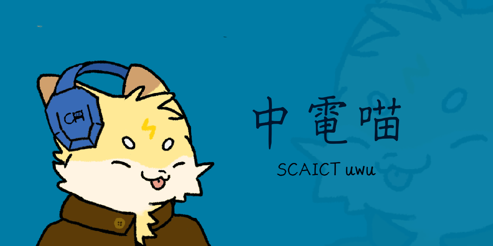

# 中電喵 SCAICT uwu
A can living in SCAICT Discord Group



> This project is still in beta. If you have any problem, it works on my machine.

## How to run?

1. Clone this repo
2. Create python environment in 3.11
2. Install independance.
pip install flask py-cord mysql-connector-python
3. Config channels in DataBase/server.config.json
5. Run SQL Server
100. Config SQL Server in BreadcrumbsSCAICT-uwu/cog/core
/sqlAcc.py
999. flask run
373. python main.py

## Files

* main.py: Discord Bot
* app.py: Flask Web App
* generate-secrets.py: Generate Secret Key for app.py. Run and save it in token.json
* Database MySQL:使用外部伺服器，相關設定在cog/core/secret.py
* token.json

```json
{
    "token":"",
    "secret_key":"",
    "client_id":"",
    "client_secret":"",
    "redirect_uri":"http://127.0.0.1:5000/callback"
}
```
* database/slot.json

Set the possibility for slot machine.

```
 {
    "element": [percentage,reward]
 }
 ```


## credits

Made by SCAICT

<a href="https://www.flaticon.com/free-icons/slot-machine" title="slot machine icons">Slot machine icons created by Freepik - Flaticon</a>
